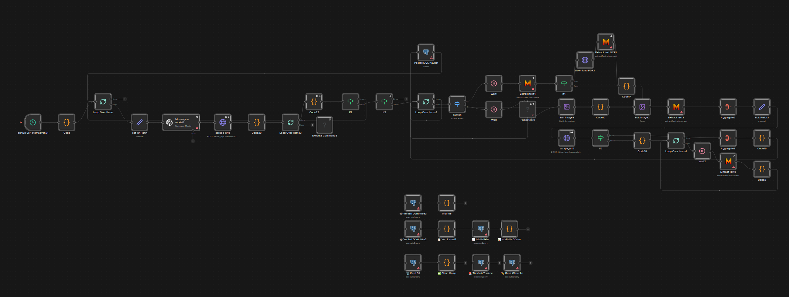

# 🔍 News Scraper — Multi-Source Automation (n8n)

> An n8n workflow that automatically scrapes, classifies, and stores news & announcements from any listing page — using AI-generated parsers, OCR, and PostgreSQL.

---

## 📌 Overview

This workflow runs on a daily schedule and monitors any number of news or announcement pages you configure. It uses GPT to auto-generate a site-specific Python parser for each source, then scrapes, classifies, and stores the results in a PostgreSQL database.

**Designed for any site that has:**
- A public news/announcement listing page
- Items with a visible date, title, and link

---

---

## 🏗️ Architecture

```
Schedule Trigger (daily)
        │
        ▼
   Site Config (Code Node)
   → define your target URLs & sample HTML here
        │
        ▼
   Loop Over Sites
        │
        ├─► GPT-4.1: Auto-generate a site-specific Python parser
        │
        ├─► Firecrawl: Scrape the full HTML of the listing page
        │
        ├─► Execute Python: Extract links matching today's date
        │
        ├─► Classify each link  (page / PDF / other)
        │
        ├─► Loop Over Links
        │       │
        │       ├── [page]     → Puppeteer screenshot → segment → Mistral OCR
        │       │
        │       └── [PDF/doc]  → HTTP download → Mistral OCR
        │
        └─► PostgreSQL: Save title, url, source, content, date
```

---

## ✨ Key Features

| Feature | Description |
|---|---|
| 🤖 **AI Parser Generation** | GPT-4.1 generates a custom Python parser per site from an HTML sample — no manual selector writing |
| 📄 **PDF OCR** | Mistral AI extracts full text from downloaded PDFs |
| 🖼️ **Screenshot OCR** | Web pages are screenshotted, segmented into chunks, and OCR'd |
| 🔗 **Smart Link Classifier** | Detects page vs PDF vs other file via extension, Content-Type headers, and URL patterns |
| 🔄 **Loop & Retry Logic** | Graceful error handling with configurable retries |
| 💾 **PostgreSQL Storage** | Structured records: source, title, URL, content, crawled date |
| 🗂️ **DB Management Nodes** | Built-in nodes for viewing, filtering, updating, deleting, and exporting records |

---

## ⚙️ Setup

### Prerequisites

- n8n instance (self-hosted or cloud)
- [Firecrawl](https://firecrawl.dev) API key
- [Mistral AI](https://console.mistral.ai) API key
- [OpenAI](https://platform.openai.com) API key
- PostgreSQL database

### 1. Database

```sql
CREATE TABLE public.news_reports (
    id           SERIAL PRIMARY KEY,
    title        TEXT NOT NULL,
    url          TEXT,
    source       TEXT,
    content      TEXT,
    crawled_date TEXT,
    created_at   TIMESTAMP DEFAULT NOW()
);
```

### 2. Import Workflow

1. Copy `workflow.json`
2. In n8n: **Workflows → Import from file**
3. Configure your credentials:
   - `Postgres account` → your PostgreSQL connection
   - `Mistral Cloud account` → your Mistral API key
   - `OpenAi account` → your OpenAI API key
   - In the two **HTTP Request** (Firecrawl) nodes, replace `YOUR_FIRECRAWL_API_KEY` in the `Authorization` header

### 3. Add Your Sites

Open the **`Code`** node at the start of the workflow. Each entry in the `sites` array defines one source:

```js
{
  tarih: "2025-01-01",             // Date to filter (YYYY-MM-DD)
  eşleşen_tarih_yoksa: "hepsini",  // "hepsini" = collect all if no date match found
  site_ismi: "my_source",          // Short identifier stored in the DB as source
  ana_url: "https://example.com/news",  // The news listing page URL

  site_yapısı: `
    <!-- Paste ONE real HTML snippet from the listing page here.
         It should include a news item with its date, title, and link.
         GPT reads this to auto-generate the parser. -->
    <div class="news-item">
      <span class="date">01.01.2025</span>
      <a href="/news/article-slug"><h2>Article Title</h2></a>
    </div>
  `
}
```

Add as many entries as you need — the workflow loops over all of them.

---

## 🗂️ Database Management

Utility nodes are included in the workflow:

| Node | Action |
|---|---|
| 👁️ View Records | Latest 50 records with content preview |
| 📈 Statistics | Total count, unique sources, date range, avg content length |
| ✏️ Update Record | Update title/url/content by ID |
| 🗑️ Delete Record | Delete one record by ID |
| 🚨 Clear All | Truncate the entire table |
| 💾 Export | Download all records as a `.json` file |

---

## 🛠️ Tech Stack

- **[n8n](https://n8n.io)** — Workflow automation
- **[Firecrawl](https://firecrawl.dev)** — JS-rendered scraping
- **[OpenAI GPT-4.1](https://platform.openai.com)** — Dynamic parser code generation
- **[Mistral AI](https://mistral.ai)** — PDF & image OCR
- **[Puppeteer](https://pptr.dev)** — Headless browser screenshots
- **PostgreSQL** — Structured data storage

---

## 📁 Repository Structure

```
├── workflow.json    # n8n workflow — credentials & site configs removed
└── README.md
```

---

## ⚠️ Disclaimer

This tool is intended for personal, research, or internal use. Always review the Terms of Service and `robots.txt` of any website before scraping it. The author is not responsible for misuse.

---

## 📄 License

MIT
